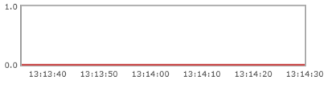
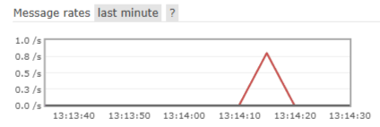
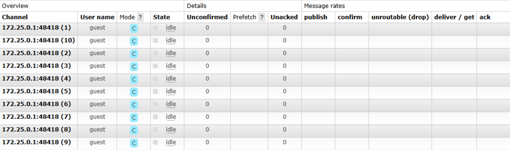

## Зачем нужен RabbitMQ?
- В сложных системах, где сервисы взаимодействуют между собой, можно организовать общение сервисов через внешний API, но это идея не самая логичная так как мы встретимся с проблемами, сервис-получатель недоступен, вызывающий сервис либо ждёт, либо падает. Это приводит к каскадным отказам и плохой масштабируемости. Лучше использовать брокеры сообщений такой как `RabbitMQ` который создает очередь сообщений и передает их между издателем и потребителем.

## Что такое RabbitMQ?
- RabbitMQ — это брокер сообщений. Выступает посредником между сервисами: producer отправляет сообщение в exchange, указав routing key маршрутизирует их через exchange смотрит на binding key сравнивая ключи:
  - direct — routing key == binding key (точное совпадение)
  - fanout — ключи игнорируются, шлёт во все очереди
  - topic — сопоставление по шаблону 
 доставляет consumer.  Обеспечивает буферизацию, гарантию доставки и гибкую маршрутизацию.

Путь сообщения:

```
producer ──publish──▶ exchange ──bindings──▶ queue ──push──▶ consumer
```

Зачем прослойка? Разделение ответственности:

- **producer** знает только «я шлю событие `order.created` в `taxi.events`» — он не знает и не хочет знать, кто и сколько его слушает;
- **exchange** — чистая функция маршрутизации: (сообщение, routing key) → множество очередей по таблице bindings. У него нет состояния, он ничего не хранит;
- **queue** — буфер: хранит сообщения, пока их не заберут и не подтвердят;
- **binding** — связь «exchange → очередь» с ключом; правила маршрутизации живут здесь, их можно менять на живом брокере, не трогая код продюсеров.

## Плюсы RabbitMQ:

1. Асинхронность — producer не ждёт consumer.
2. Гарантия доставки — ack/nack, persistent messages, durable queues.
3. Гибкая маршрутизация — 4 типа exchange: direct, fanout, topic, headers.

## Минусы / сложности RabbitMQ:

1. Eventually consistent — не подходит для запрос-ответ в реальном времени.
2. Нужно думать об идемпотентности.
3. Дополнительная инфраструктура — сам брокер нужно поднимать, мониторить.
4. Сложнее отлаживать, чем прямой HTTP-вызов.

## Модель AMQP 

### Connection против channel

- **Connection** — это одно TCP-соединение с брокером: дорогое (handshake, аутентификация), его держат по одному на процесс.
  - TCP-рукопожатие + AMQP-рукопожатие (несколько round-trip: представление клиента, согласование `frame_max`, числа каналов и heartbeat, аутентификация, `open`);
  - при необходимости TLS;
  - **heartbeat** — служебные кадры, которыми обе стороны подтверждают живость (по умолчанию 60 сек; по отсутствию кадров соединение считается мёртвым и закрывается).

  Connection **дорогой**: несколько round-trip на установку, сокеты и память на стороне брокера.

- Channel — лёгкий «виртуальный канал» внутри этого соединения: их могут быть десятки, каждый под свой поток задач. 

 - Ключевые следствия:

  1. **Channel не потокобезопасен.** Один канал — одна логическая сессия: один поток / одна asyncio-задача. Два консьюмера — два канала. В aio-pika: `await connection.channel()` на каждую независимую роль (канал продюсера, канал консьюмера).
  2. **Ошибки канала изолированы.** Классические channel-ошибки (канал закрывается, соединение остаётся живым):
    - `404 NOT_FOUND` — publish в несуществующий exchange;
    - `406 PRECONDITION_FAILED` — redeclare очереди/exchange с *другими аргументами*, чем объявлены (частая ошибка: поменял аргумент в коде, брокер помнит старые);
    - `406 PRECONDITION_FAILED` — consumer timeout (день 10);
    - `403 ACCESS_REFUSED` — нет прав на vhost.
    
    Код обязан уметь пересоздавать канал после таких ошибок — в pika/aio-pika это обычно `RobustConnection/RobustChannel`.
  3. Каналы дёшевы, но не бесплатны: у каждого есть состояние (открытые консьюмеры, unacked, confirms). Десятки на соединение — норма; тысячи — уже тревога.

**В Management UI** это видно буквально: вкладка *Connections* — по строке на TCP-соединение, вкладка *Channels* — по строке на канал (у каждого видно родительское соединение, число unacked, prefetch).

## Неотмаршрутированные сообщения

**По умолчанию — оно молча удалено.** Ни ошибки клиенту, ни лога, ни метрики в UI. Это осознанный дизайн AMQP (fire-and-forget), но на практике — главный способ тихо потерять события из-за опечатки в routing key или забытом binding'е. Два уровня защиты:

### 1) `mandatory=True`

Флаг метода `basic.publish`. Если сообщение не маршрутизируется никуда, брокер **возвращает его отправителю** методом `basic.return` — на тот же канал. Клиент должен повесить обработчик возвратов:

- в pika: `channel.add_on_return_callback(...)` + флаг `mandatory=True` в publish;
- в aio-pika: `publish(..., mandatory=True)` — при включённом режиме `on_return_raises` публикация unroutable-сообщения бросает `UnroutableError`.

Ограничение: это проверка «на месте», в момент publish — она ловит проблемы маршрутизации, но не гарантирует ничего дальше.

### 2) Alternate exchange (AE)

Аргумент при объявлении exchange: `x-alternate-exchange: <имя>`. Все unroutable-сообщения **переиздаются в этот exchange**. Обычно AE — fanout, ведущий в очередь `unroutable`: единая «почта невостребованных» для всех продюсеров данного exchange'а. Если у AE есть свой AE — цепочка продолжается.


### Эксперимент №1 Опубликовать сообщение с routing key, под который нет ни одного binding.

**Цель**

- Отправить сообщение с **produser** в обменник RabbitMQ, в несуществующий binding

**Ожидания**
- Отправляя запись в обменник с **routing key**, к которому не подойдет **binding key**, запись просто потеряется и все


**Ход**
1. Запускаем `produser` с неправильным **routing key** который не сможет передать в очередь по **binding key** записи.
2. Отправляем запросы

**Результат** 

**Queued messages**



**Message rates**



- В **RabbitMQ Managment** на графиках **Queued messages** мы не видим, что записи добавляются в очередь, но на графике **Message rates** мы видим активности записи передаются, из этого можно сделать вывод, что данные тихо удаляются при передачи не корректного **routing key** в обменник. 


### Эксперимент №2 1 Connection + 10 Channels.

**Цель**

Показать, что RabbitMQ спроектирован так, чтобы использовать одно TCP-соединение (Connection) и много логических каналов (Channels) внутри него. Это фундаментальная архитектурная концепция AMQP.

**Ход**
- Создать 10 соединений через цикл `range(10)`

**Результат**



- Connection — это TCP-соединение. Оно дорогое: требует TCP handshake, аутентификации, выделения памяти и процесса Erlang на стороне брокера.
- Channel — это виртуальное соединение (логический "поток" внутри TCP-соединения). Оно дешёвое: создаётся за микросекунды, почти не потребляет память, и RabbitMQ может держать миллионы каналов одновременно.

**Вывод**

- Использование одного соединения с множеством каналов вместо множества 
отдельных соединений позволяет:

1. Экономить ресурсы:
   - Меньше TCP-соединений (1 вместо 10)
   - Меньше портов на сервере
   - Меньше памяти на буферы
   - Меньше процессов Erlang на стороне RabbitMQ

2. Ускорить работу:
   - Создание канала: ~1мс
   - Создание соединения: ~100мс (TCP handshake + аутентификация)


### Эксперимент №3: Проверка буферизации 

**Цель**
- проверить, что при остановленном consumer'е сообщения не теряются, а накапливаются в очереди, и обрабатываются после его запуска.

**Ожидания**
- Броккер не потеряет ни единого заказа и при запуске `consumer.py` обработает все накапившиеся запросы.

**Ход:**
1. Запускаем FastAPI и RabbitMQ, но не запускаем consumer
2. Отправляем запросы
3. Заходим **RabbitMQ Managment** и на графике **Queued messages** увидим количество сделанных запросов, которые должны совпасть
4. Запускаем `consumer.py` и видим что все сделанные запросы выполнились.

**Вывод:**
- RabbitMQ буферизует сообщения, пока consumer недоступен. Producer не блокируется и не знает о состоянии consumer'а.


### Эксперимент №4: Проверка распарсинга данных

**Цель**
- Испортить ключи которые передают информацию из очереди в `consumer.py` и посмотреть как будет вести себя очередь.

**Ожидания**
- Данные не потреряются и просто останутся в очереди.

**Ход:**
1. Запускаем FastAPI, RabbitMQ и consumer и в нем портим ключи
2. Отправляем 3 запроса

**Вывод:**
- При некорректных ключах в `consumer` данные не обрабатываются и выходит ошибка `Task exception was never retrieved`
- В **RabbitMQ Management** на графике видим:
  - Скачок на линии **Deliver (manual ack)** — сообщения доставлены consumer'у
  - Скачок на линии **Redelivered** — сообщения возвращались в очередь
- Поля **Ready** и **Total** не равны нулю → данные **не потерялись** и остались в очереди

**Итог:**  
Эксперимент подтвердил ожидания: RabbitMQ **гарантирует доставку** сообщений даже при ошибках в consumer. Сообщения не теряются, а накапливаются в очереди до исправления кода. Это критически важно для надёжных систем.

### Эксперимент №5: Масштабирование

**Цель**
- Запустить несколько `consumer` и проверить как будет вести себя RabbitMQ.

**Ход:**
- Запустим в двух терминалах `consumer.py` 
- Сдеаем 6 заказов через API

**Результат:**  
Каждый consumer обработал ровно по 3 заказа.

**Вывод:**  
RabbitMQ автоматически распределяет сообщения между consumer'ами по принципу **round-robin** (по очереди). Это позволяет **горизонтально масштабировать** систему: при росте нагрузки можно просто добавить ещё один consumer, и RabbitMQ сам разделит работу поровну.

**Практическая ценность:**
- Нет необходимости вручную балансировать нагрузку
- Можно добавлять consumer'ы "на лету" без изменения кода producer'а
- Система устойчива к пиковым нагрузкам